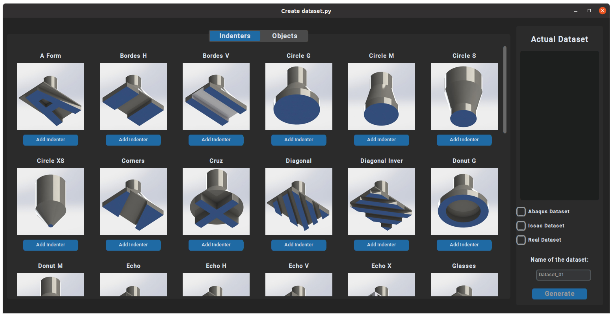

# Tactile Contact Patterns for Robotic Grasping: A Dataset of Real and Simulated Data
<p>

</p>


## Table of Contents

- [Overview](#overview)
- [Dataset](#dataset)
  - [Experimental Scenarios](#experimental-scenarios)
- [Installation](#installation)
  - [Prerequisites](#prerequisites)
- [Usage](#usage)
- [License](#license)
- [Citation](#citation)
- [Contact](#contact)
- [Download More Information](#download-more-information)

## Overview

Welcome to the **TactileDataset GUI** repository! This project provides a graphical user interface (GUI) for accessing and utilizing a comprehensive tactile dataset, which includes both real and simulated data from a capacitive tactile sensor. This dataset is designed to support research in tactile robotics and machine learning, particularly focusing on sim-to-real applications.

This repository is linked to our conference paper, "[Tactile Contact Patterns for Robotic Grasping: A Dataset of Real and Simulated Data]."


## Dataset

The **TactileDataset** comprises a total of **46,200 samples**, equally divided into three main groups:

- **15,400 Real Samples**: Collected from experiments using a deformable, capacitive-based tactile sensor.
- **15,400 Synthetic Samples (Abaqus)**: Generated using Abaqus finite element analysis.
- **15,400 Synthetic Samples (Isaac Gym)**: Generated using Isaac Gym through finite element analysis.

### Experimental Scenarios

1. **Indenter Press Tests**:
   - **49 Unique Indenters** pressed onto the sensor at various force levels.
   - Generates a diverse array of contact patterns.

2. **Grasping Tests**:
   - Integration of the sensor into a **2F-85 Robotiq parallel gripper**.
   - Grasping **12 different objects** to capture varied tactile interactions.
  
## Installation

### Prerequisites

- Python 3.7 or higher
- [customtkinter](https://pypi.org/project/customtkinter/)for the GUI
- [Pandas](https://pypi.org/project/pandas/) for data handling
- [Matplotlib](https://pypi.org/project/matplotlib/) for visualization
- [h5py](https://pypi.org/project/h5py/) for HDF5 file interaction
- [pillow](https://pypi.org/project/pillow/) for image processing and manipulation

### Steps

1. **Clone the Repository**:
   ```bash
   git clone https://github.com/Lab-CORO/TactileDataset.git
   cd TactileDataset

2. **Install Dependencies**:
   ```bash
   pip install -r requirements.txt
   
2. **Download Dataset**:

Please download the dataset from 🔗 [DatasetFiles]([https://os5.mycloud.com/action/share/daf9c31c-53b8-485b-b6ef-5ca75bfcfc75](https://os5.mycloud.com/action/share/dc475405-9198-4860-85c9-aeb3d8f79a09)) and place it in the main folder of the repository to ensure proper functionality.
    
## Citation
If you use this dataset or GUI in your research, please cite our conference paper:
  
```bibtex
@unpublished{BerKwaJea2024,
  title={Tactile Contact Patterns for Robotic Grasping: A Dataset of Real and Simulated Data},
  author={De la Cruz-S{\'a}nchez, Berith Atemoztli and Kwiatkowski, Jennifer and Roberge, Jean-Philippe},
  note         = {Manuscript submitted for publication},
  year={2024},
}
```

## Contact
For any questions, suggestions, or feedback, please feel free to reach at:

**Lead Maintainer:**  
**[Berith De la cruz Sanchez]**  
**Email:** [berithcruzs@gmail.com](mailto:berithcruzs@gmail.com)  
**GitHub:** [BerithCS](https://github.com/BerithCS)

## Download More Information

For additional details, including the latest updates to the dataset and the GUI, please visit our GitHub repository:

🔗 [CAD Files of Indenters and Objects](https://os5.mycloud.com/action/share/e043f2bd-d56c-4e53-b178-062b4b60af09)
🔗 [Simulation Scripts](https://os5.mycloud.com/action/share/daf9c31c-53b8-485b-b6ef-5ca75bfcfc75)


  
